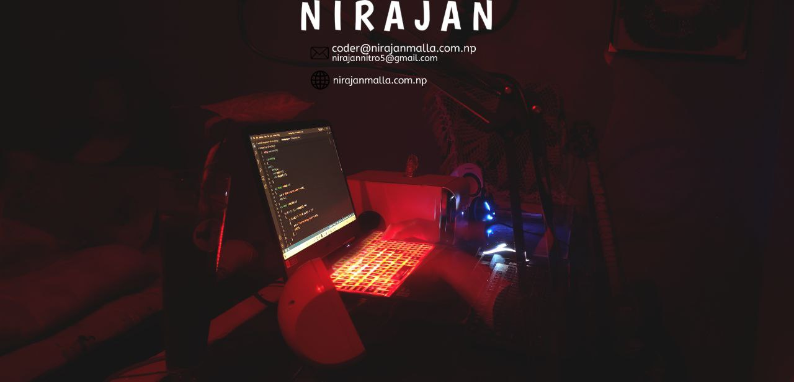

 

---

 
 
 

Fullstack Engineer & Shopify Developer.

Building React/Next.js apps and Shopify stores for clients across Australia.
Three years freelancing, 50+ projects, all five star rated.

 

**Core stack**

React · Next.js · TypeScript · Tailwind CSS · Node.js · Shopify Liquid

**Also work with**

Zustand · TanStack Query · ShadCN · Firebase · MySQL · n8n · Flowise · Linux · Vercel

---

**Selected work**

- [Dukes Coffee](https://dukescoffee.com.au) — Full Shopify rebuild. 11+ custom Liquid sections, fluid typography, metafields architecture, filter system, cart drawer redesign. Solo on a live production store.
- [Socrates](https://github.com/NirajanM/PROJECT-SOCRATES) — Field data collection platform with supervisor web app and companion mobile app. React, Firebase, OpenStreetMap.
- [LetsWatchMovie](https://letswatchmovie.pages.dev) — Movie browser with watchlist, filters, trailers, infinite scroll. React, Redux, TanStack Query.
- [Rise & Shine](https://riseandshinee.com.np) — Restaurant order management system. Next.js 15, TypeScript, Zustand, offline persistence, printable receipts.
- [Ordinal Scan](https://ordinalscan.netlify.app) — Bitcoin Ordinals P&L calculator with 1099 tax export. React, Hiro API, Mempool API.

---

**Currently**

Open to remote Shopify developer and frontend/fullstack roles.

[Portfolio](https://nirajanmalla.com.np) · [LinkedIn](https://np.linkedin.com/in/nirajan-malla) · [Email](mailto:coder@nirajanmalla.com.np) · [Discord](https://discord.com/users/461510337678540822)
