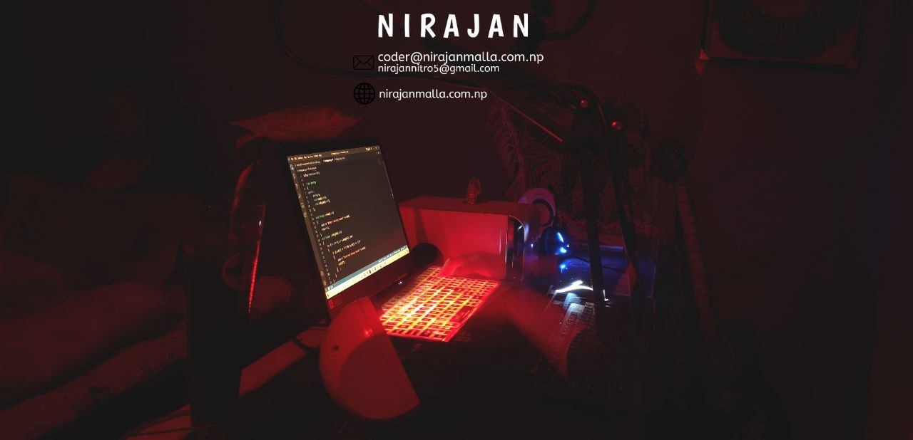

 
 

   

 
 
 
   
   
  

- Full stack developer (MERN)
- loves React.ts
- crush on web 3.0 and metaverse
- good at programming
- coding everyday
  
  
 
any freelance work ?, [do reach me](mailto:nirajannitr05@gmail.com)  💬 ask me about anything, i am happy to help;
 
  
 My holopin collection:

  

 

  ---

<h2>STATS:</h2>
 
 

 <h4>Hands-on Skills:</h4>
  

  &nbsp;
  &nbsp;
  &nbsp;
  &nbsp;
  &nbsp;
  &nbsp;
  &nbsp;
  &nbsp;
  &nbsp;
  &nbsp;
  &nbsp;
  &nbsp;
  &nbsp;
  &nbsp;
  &nbsp;
  &nbsp;
  

 
  

 
  <h4>find me on :</h4>
   

  
  

 

